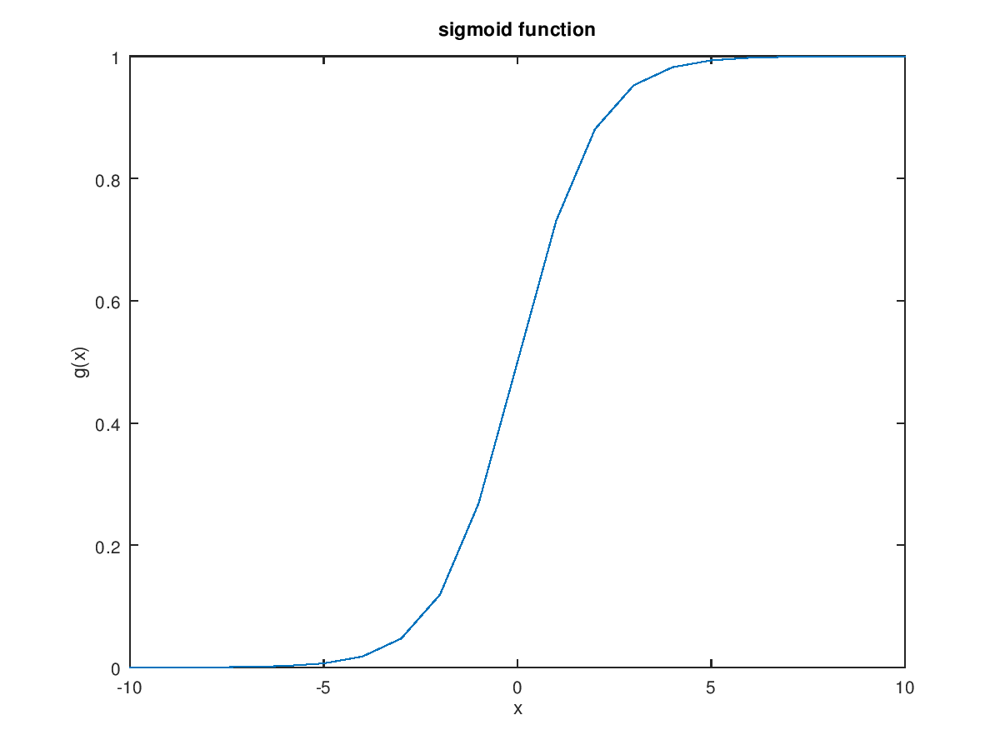

## 逻辑回归
> 线性回归在某些情况无法拟合分类问题。
> 在线性拟合中，假设函数的形式为：
> $h_\theta(x)=\theta^Tx$
> 在逻辑回归中，假设函数的形式为：
> $h_\theta(x)=g(\theta^Tx)$
> $g(x)=\frac{1}{1+e^{-z}}$
> $g(x)$被称为S型函数(sigmoid function)或逻辑函数

> **example**
> 肿瘤大小预测是否为良性或恶性
> $x=\begin{pmatrix}
    x_0 \\
    x_1
    \end{pmatrix}=
    \begin{pmatrix}
    1 \\
    肿瘤大小
    \end{pmatrix}$
> if $h_\theta(x)=0.7$
> 则告诉病人有70%的可能性为恶性
> $h_\theta(x)=p(y=1|x;\theta)$
> $p(y=0|x;\theta)=1-p(y=1|x;\theta)$

> **预测y=1或y=0**
> **if** $h_\theta(x)>=0.5,y=1$
> **if** $h_\theta(x)<0.5,y=0$
> $\because g(x)=\cfrac{1}{1+e^{-\theta^Tx}}$
> $\therefore$ **if** $\theta^Tx \geqslant 0,y=1$
> &ensp;&nbsp; **if** $\theta^Tx \leqslant 0,y=1$

> **决策边界**
> 将一侧的所有点分类为属于一个类，而将另一侧的所有点分类为属于另一个类。
> 假设$h_\theta(x)=g(-3+1x_1+1x_2)$
> **if** y==1,则$-3+1x_1+1x_2\geqslant0,即x_1+x_2<3$
> 此时，决策边界为$x_1+x_2=3$
> **Note:**
> 决策边界不是训练集的属性，而是假设本身及其参数的属性。